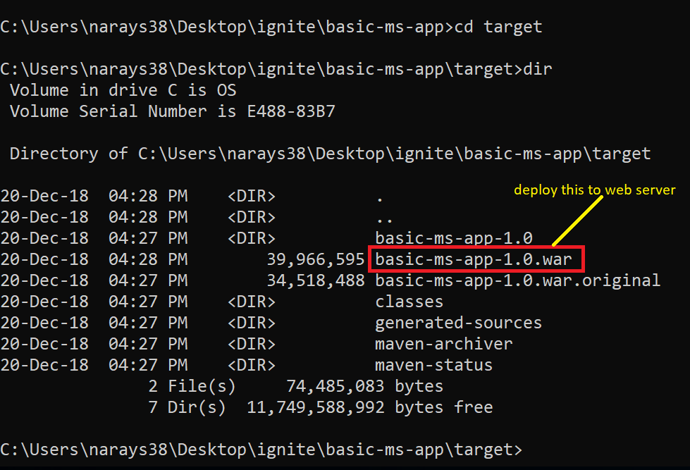

# Basic Microservice App

#### Basic ms app with simple crud and swagger enabled

Execute the below command from the project root directory.

``` 
mvn clean package
```

Once that is done, you can find a `war` file in the `target` directory of the project.



Deploy the highlighted war file `basic-ms-app-1.0.war` onto your web server like Tomcat / Jetty / Nginx / Jboss.

Once the application starts, access the below link in browser, this will take you to the swagger page of the app.

http://localhost:PORT/basic-ms-app

Here `PORT` refers to the port number on which your web server is listening for requests.
